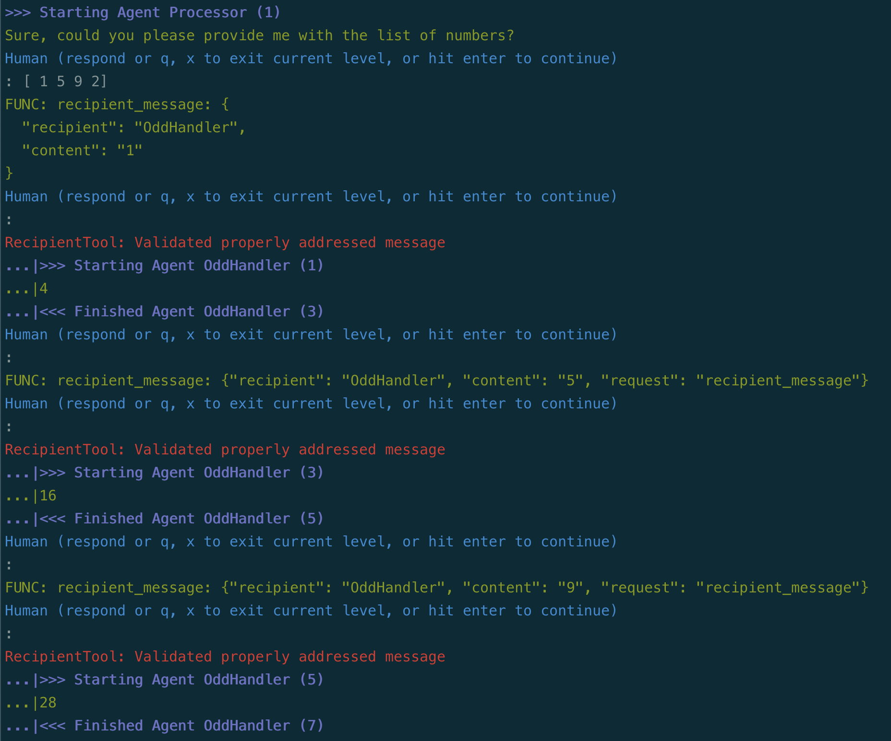

# Three-Agent Collaboration, with message Routing

!!! tip "Script in `Nilenetworks-examples`"
    A full working example for the material in this section is
    in the `three-agent-chat-num-router.py` script in the `Nilenetworks-examples` repo:
    [`examples/quick-start/three-agent-chat-num-router.py`](https://github.com/Nilenetworks/Nilenetworks-examples/tree/main/examples/quick-start/three-agent-chat-num-router.py).

Let's change the number game from the [three agent chat example](three-agent-chat-num.md) slightly.
In that example, when the `even_agent`'s LLM receives an odd number,
it responds with `DO-NOT-KNOW`, and similarly for the `odd_agent` when it
receives an even number. The `step()` method of the `repeater_task`
considers `DO-NOT-KNOW` to be an _invalid_ response and _continues_ to 
look for a valid response from any remaining sub-tasks.
Thus there was no need for the `processor_agent` to specify who should handle
the current number.

But what if there is a scenario where the `even_agent` and `odd_agent`
might return a legit but "wrong" answer?
In this section we add this twist -- when
the `even_agent` receives an odd number, it responds with -10, and similarly
for the `odd_agent` when it receives an even number.
We tell the `processor_agent` to avoid getting a negative number.

The goal we have set for the `processor_agent` implies that it 
must specify the intended recipient of 
the number it is sending. 
We can enforce this using a special Nilenetworks Tool, 
[`RecipientTool`][Nilenetworks.agent.tools.recipient_tool.RecipientTool].
So when setting up the
`processor_task` we include instructions to use this tool
(whose name is `recipient_message`, the value of `RecipientTool.request`):

```py
processor_agent = lr.ChatAgent(config)
processor_task = lr.Task(
    processor_agent,
    name = "Processor",
    system_message="""
        You will receive a list of numbers from me (the user).
        Your goal is to apply a transformation to each number.
        However you do not know how to do this transformation.
        You can take the help of two people to perform the 
        transformation.
        If the number is even, send it to EvenHandler,
        and if it is odd, send it to OddHandler.
        
        IMPORTANT: send the numbers ONE AT A TIME
        
        The handlers will transform the number and give you a new number.        
        If you send it to the wrong person, you will receive a negative value.
        Your aim is to never get a negative number, so you must 
        clearly specify who you are sending the number to, using the
        `recipient_message` tool/function-call, where the `content` field
        is the number you want to send, and the `recipient` field is the name
        of the intended recipient, either "EvenHandler" or "OddHandler".        
        
        Once all numbers in the given list have been transformed, 
        say DONE and show me the result. 
        Start by asking me for the list of numbers.
    """,
    llm_delegate=True,
    single_round=False,
)
```

To enable the `processor_agent` to use this tool, we must enable it:
```py
processor_agent.enable_message(lr.agent.tools.RecipientTool)
```

The rest of the code remains the same as in the [previous section](three-agent-chat-num.md),
i.e., we simply add the two handler tasks
as sub-tasks of the `processor_task`, like this:
```python
processor_task.add_sub_task([even_task, odd_task])
```

One of the benefits of using the `RecipientTool` is that it contains 
mechanisms to remind the LLM to specify a recipient for its message,
when it forgets to do so (this does happen once in a while, even with GPT-4).


Feel free to try the working example script
`three-agent-chat-num-router.py` in the 
`Nilenetworks-examples` repo:
[`examples/quick-start/three-agent-chat-num-router.py`](https://github.com/Nilenetworks/Nilenetworks-examples/tree/main/examples/quick-start/three-agent-chat-num-router.py):

```bash
python3 examples/quick-start/three-agent-chat-num-router.py
```

Below is screenshot of what this might look like, using the OpenAI function-calling 
mechanism with the `recipient_message` tool:



And here is what it looks like using Nilenetworks's built-in tools mechanism (use the `-t` option when running the script):


And here is what it looks like using 
## Next steps

In the [next section](chat-agent-docs.md) you will learn
how to use Nilenetworks with external documents.

